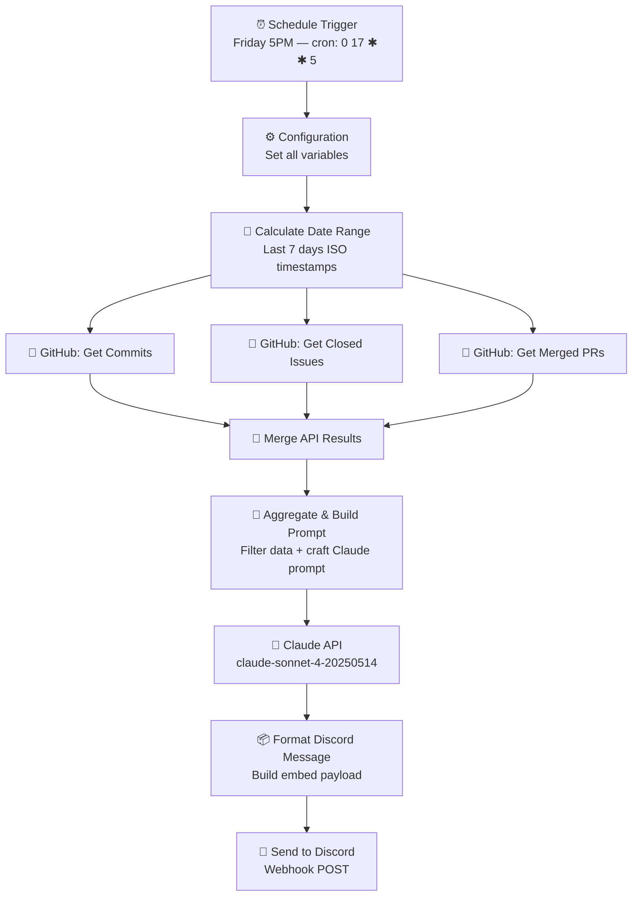

# 📊 GitHub Weekly Summary — n8n + Claude AI

An n8n workflow that runs every **Friday at 5 PM**, fetches your GitHub
repo's weekly activity (commits, closed issues, merged PRs), and delivers
a narrative AI-generated summary to **Discord** via Claude claude-sonnet-4-20250514.

---

## Workflow Architecture



---

## ⚡ Setup in 5 Steps

### Step 1 — Import the workflow

1. Open your n8n instance (`http://localhost:5678` or your cloud URL)
2. Click **Workflows → Import From File**
3. Select `workflow.json` from this repo
4. The workflow opens in the editor

### Step 2 — Get your credentials

| Credential | Where to get it |
|---|---|
| **GitHub Token** | GitHub → Settings → Developer settings → Personal access tokens → Fine-grained token. Scopes needed: `contents:read`, `issues:read`, `pull_requests:read` |
| **Claude API Key** | [console.anthropic.com](https://console.anthropic.com) → API Keys |
| **Discord Webhook** | Discord Server → Channel Settings → Integrations → Webhooks → New Webhook → Copy URL |

### Step 3 — Fill in the Configuration node

Open the **⚙️ Configuration** node and replace the placeholder values:

| Variable | Example Value |
|---|---|
| `GITHUB_OWNER` | `octocat` |
| `GITHUB_REPO` | `Hello-World` |
| `GITHUB_TOKEN` | `ghp_abc123...` |
| `CLAUDE_API_KEY` | `sk-ant-api03-...` |
| `DISCORD_WEBHOOK_URL` | `https://discord.com/api/webhooks/...` |
| `LANGUAGE` | `EN` or `FR` |

### Step 4 — Test manually

1. Click **Test Workflow** (▶️ button) in the n8n editor
2. Watch each node turn green
3. Check your Discord channel for the summary message
4. Verify the execution log shows no errors

### Step 5 — Activate

Toggle the **Active** switch (top right) to enable the weekly schedule.
The workflow will now auto-run every **Friday at 5:00 PM** (UTC).

---

## 🗂️ Configurable Variables Reference

```
GITHUB_OWNER        → GitHub username or org name
GITHUB_REPO         → Repository name (no slashes)
GITHUB_TOKEN        → Personal Access Token (read-only scopes)
CLAUDE_API_KEY      → Anthropic API key
DISCORD_WEBHOOK_URL → Full Discord webhook URL
LANGUAGE            → EN (English) or FR (French)
```

---

## 🔧 Delivery Method

This workflow uses **Discord webhook** (no bot token required).
The message arrives as a rich embed with:
- AI narrative summary (Claude)
- Commit / Issue / PR counters in the footer
- Timestamp and repo name in the title

### Want Email instead?

Replace the **📨 Send to Discord** node with an **Email** node
(SMTP or Gmail), and change the **📦 Format Discord Message** node
to output a plain HTML string.

---

## 📸 Execution Screenshot

> Replace with a real screenshot after your first successful test run.


---

## 🐛 Troubleshooting

| Symptom | Fix |
|---|---|
| `401 Unauthorized` from GitHub | Token expired or wrong scopes — regenerate |
| `authentication_error` from Claude | Wrong `CLAUDE_API_KEY` value |
| Discord shows no message | Verify webhook URL is valid and channel exists |
| Empty summary | Repo had no activity — Claude will note this gracefully |
| Node shows `model not found` | Confirm your Anthropic account has access to `claude-sonnet-4-20250514` |

---

## License

MIT
